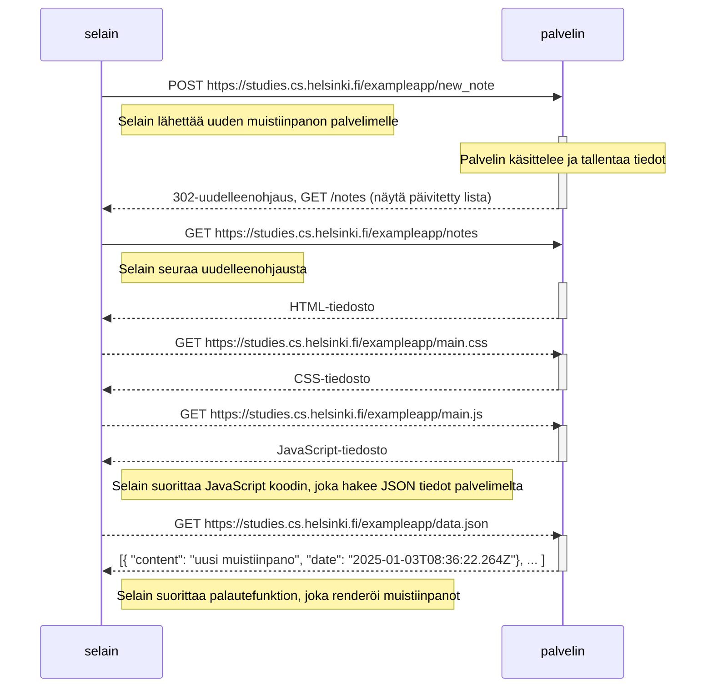

```mermaid
sequenceDiagram
    participant selain
    participant palvelin

    selain->>palvelin: POST https://studies.cs.helsinki.fi/exampleapp/new_note
    Note right of selain: Selain lähettää uuden muistiinpanon palvelimelle
    activate palvelin
    Note over palvelin: Palvelin käsittelee ja tallentaa tiedot 
    palvelin-->>selain: 302-uudelleenohjaus, GET /notes (näytä päivitetty lista)
    deactivate palvelin

    selain->>palvelin: GET https://studies.cs.helsinki.fi/exampleapp/notes
    Note right of selain: Selain seuraa uudelleenohjausta
    activate palvelin
    palvelin-->>selain: HTML-tiedosto
    deactivate palvelin

    selain-->>palvelin: GET https://studies.cs.helsinki.fi/exampleapp/main.css
    activate palvelin
    palvelin-->>selain: CSS-tiedosto
    deactivate palvelin

    selain-->>palvelin: GET https://studies.cs.helsinki.fi/exampleapp/main.js
    activate palvelin
    palvelin-->>selain: JavaScript-tiedosto
    deactivate palvelin

    Note right of selain: Selain suorittaa JavaScript koodin, joka hakee JSON tiedot palvelimelta

    selain-->>palvelin: GET https://studies.cs.helsinki.fi/exampleapp/data.json
    activate palvelin
    palvelin-->>selain: [{ "content": "uusi muistiinpano", "date": "2025-01-03T08:36:22.264Z"}, ... ]
    deactivate palvelin

    Note right of selain: Selain suorittaa palautefunktion, joka renderöi muistiinpanot
```
